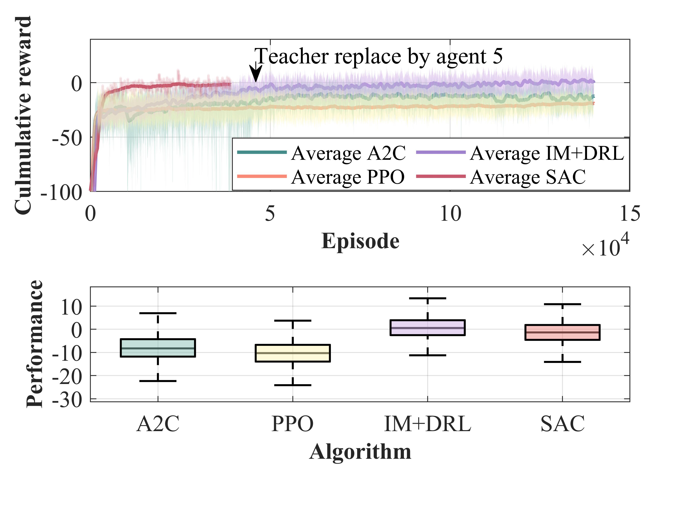

# Intelligent Bridge Management System

This repository presents an **intelligent bridge inspection & maintenance planning framework** based on **Deep Reinforcement Learning (DRL)**. The goal is to **keep structural risk within an acceptable level** while **minimizing life-cycle maintenance cost**, addressing limitations of traditional bridge management that often relies on conservative expert judgment and fixed inspection intervals.

The decision-making agent takes **bridge/component condition information** as input and outputs **implementable actions** for the maintenance procedure, including:
- inspection timing/scheduling,
- preventive maintenance,
- rehabilitation decisions.

The methodology is developed to be compatible with practical bridge management workflows and to scale to component-level planning.

## Motivation

Bridge deterioration reduces structural capacity and can affect both serviceability and ultimate limit states, potentially leading to failure. Meanwhile, maintenance budgets are constrained and bridges are aging worldwide. A major challenge is to **optimize inspection and treatment decisions over the service life** under uncertainty, cost, and safety/risk constraints.

## Key Ideas & Contributions

This project (and the associated paper) develops several core techniques for component-level bridge life-cycle management:

- **Actor–Critic DRL for maintenance decision-making**: learns a policy that maps structural states to inspection & maintenance actions.
- **Hybrid Markov decision processes (MDPs)**: designed to accommodate **heterogeneous deterioration patterns** (e.g., different component types and stochastic models) within a unified framework.
- **Action-space simplification via ranking**: introduces a ranking model to reduce the decision complexity **from exponential to linear growth** with the number of components, enabling practical component-level recommendations.
- **Imitation learning + DRL training mechanism**: integrates expert demonstrations to guide early exploration, mitigate convergence issues in complex environments, and accelerate training stability.

## Training Performance (Example)

## Repository Structure / Main Scripts

- `A2C_bridge_management.py`  
- `PPO_bridge_management.py`  
- `SAC_bridge_management.py`  
- `ImitationL_bridge_management.py`  

These scripts are used to train decision-making agents with different algorithms.

Trained agents/models are saved and uploaded (see the corresponding saved-model files in the repo).

- `Inspection&maintenance.py`  
Run evaluation/testing. You can test different trained methods by changing the model loading path, e.g., `load.(path)` in the script.

## How to Use (Quick Start)

1. Train an agent with one of the following scripts:
   - `A2C_bridge_management.py`, `PPO_bridge_management.py`, `SAC_bridge_management.py`, or `ImitationL_bridge_management.py`

2. Evaluate the trained agent:
   - Open `Inspection&maintenance.py`
   - Modify the agent/model loading path (e.g., `load.(path)`)
   - Run the script to compare performance across methods

> Note: If you want, I can help you add a clear “Requirements / Installation” section once you tell me your Python version and dependencies (e.g., PyTorch/TensorFlow, gym, etc.).

## Citation

If you use this repository in your research, please cite the related paper (add bibtex here).

## Keywords

Deep reinforcement learning; Imitation learning; Bridge management; Weibull model; Markov model; Maintenance optimization

